# Guide Utilisateur S.U.R.V.I.V.E. Resilience

## Table des Matières

1. [Introduction](#introduction)
2. [Démarrage Rapide](#démarrage-rapide)
3. [Module d'Analyse d'Impact (BIA)](#module-danalyse-dimpact-bia)
4. [Module de Simulation de Crise](#module-de-simulation-de-crise)
5. [Gestion des Utilisateurs et Équipes](#gestion-des-utilisateurs-et-équipes)
6. [Tableau de Bord](#tableau-de-bord)
7. [FAQ et Dépannage](#faq-et-dépannage)
8. [Glossaire](#glossaire)

---

## Introduction

### Qu'est-ce que S.U.R.V.I.V.E. Resilience ?

**S.U.R.V.I.V.E.** est l'acronyme de **Sustainability, Unity, Resilience, Vision, Innovation, Versatility, and Efficiency** (Durabilité, Unité, Résilience, Vision, Innovation, Polyvalence et Efficacité).

S.U.R.V.I.V.E. Resilience est une plateforme complète de gestion de la continuité d'activité et de préparation aux situations de crise. Elle permet aux organisations de :

- **Analyser** les impacts potentiels des interruptions d'activité
- **Simuler** des situations de crise pour entraîner les équipes
- **Gérer** les utilisateurs et les équipes de manière centralisée
- **Suivre** la progression et l'efficacité des plans de continuité

### Public Cible

Ce guide s'adresse à :

- **Administrateurs** : Configuration et gestion de la plateforme
- **Responsables de continuité** : Création et analyse des rapports BIA
- **Animateurs de crise** : Préparation et animation des simulations
- **Participants** : Utilisation de la plateforme lors des exercices

### Technologies Utilisées

- **Frontend** : Next.js 15, React 19, TypeScript, Tailwind CSS
- **Backend** : Next.js API Routes, Prisma ORM, MongoDB
- **Authentification** : NextAuth.js (Email/Password + Google OAuth)
- **IA** : Google Gemini pour l'analyse des rapports BIA
- **Communication** : Twilio (SMS), Nodemailer (Email)

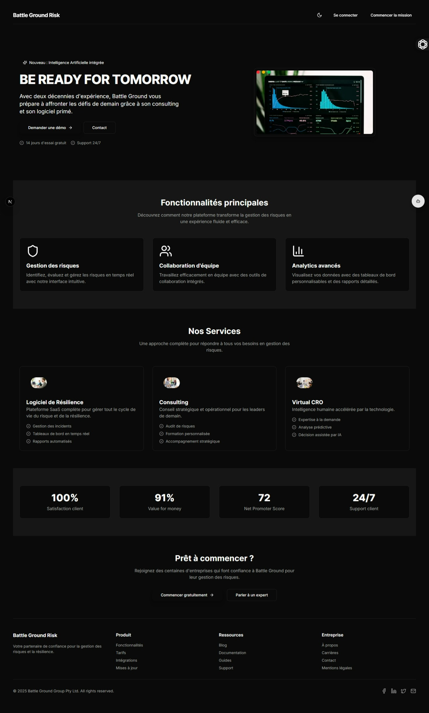

> 📸 **SCREENSHOT-01-HOME.jpeg** - Page d'accueil de S.U.R.V.I.V.E. Resilience

> 💡 **Notre devise** : _"When the going gets tough, the tough get going"_ - Quand les temps deviennent difficiles, les forts se mettent en action.

---

## Démarrage Rapide

### Inscription et Première Connexion

#### 1. Créer un Compte

1. Accédez à la page d'inscription : `/signup`
2. Remplissez le formulaire avec :
   - Votre nom complet
   - Votre adresse email professionnelle
   - Un mot de passe sécurisé (minimum 8 caractères)
3. Cliquez sur **"Créer un compte"**
4. Vérifiez votre email pour confirmer votre inscription

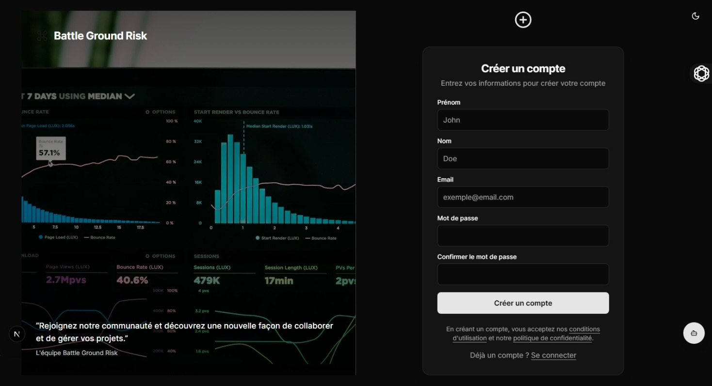

> 📸 **SCREENSHOT-02-SIGNUP.jpeg** - Formulaire d'inscription

#### 2. Se Connecter

**Option 1 : Avec Email et Mot de Passe**

1. Allez sur `/connection`
2. Entrez votre email et mot de passe
3. Cliquez sur **"Se connecter"**

**Option 2 : Avec Google**

1. Sur la page de connexion, cliquez sur **"Se connecter avec Google"**
2. Sélectionnez votre compte Google
3. Autorisez l'accès à S.U.R.V.I.V.E. Resilience

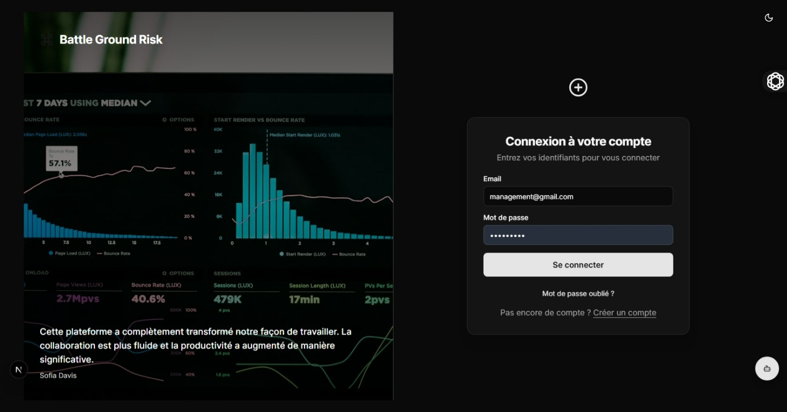

> 📸 **SCREENSHOT-03-LOGIN.jpeg** - Page de connexion avec les deux options

#### 3. Découvrir l'Interface

Une fois connecté, vous accédez au **Tableau de Bord** principal qui affiche :

- Un résumé de vos rapports BIA
- Les simulations en cours ou à venir
- Vos tâches assignées
- Des statistiques générales

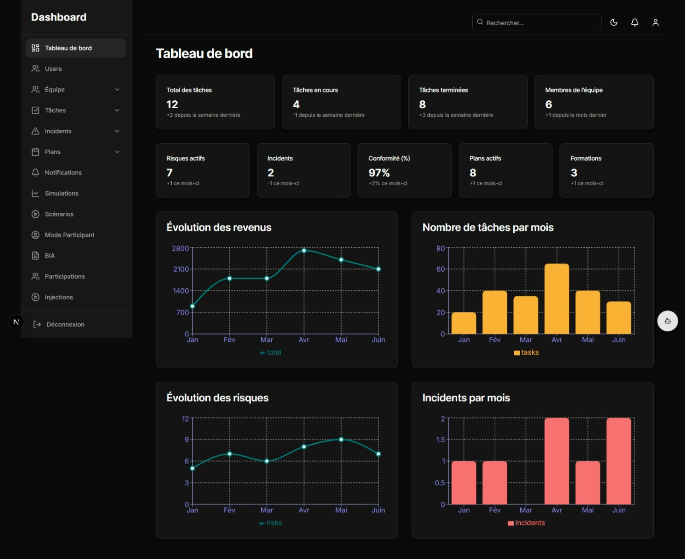

> 📸 **SCREENSHOT-04-DASHBOARD.jpeg** - Vue du tableau de bord principal

---

## Module d'Analyse d'Impact (BIA)

Le module BIA (Business Impact Analysis) vous permet d'évaluer la criticité de vos processus métier et de comprendre les impacts d'une interruption d'activité.

### 3.1 Créer un Rapport BIA

#### Étape 1 : Accéder au Module BIA

1. Dans le menu principal, cliquez sur **"BIA"** ou **"Analyse d'Impact"**
2. Vous arrivez sur la liste des rapports existants
3. Cliquez sur le bouton **"+ Nouveau Rapport"**

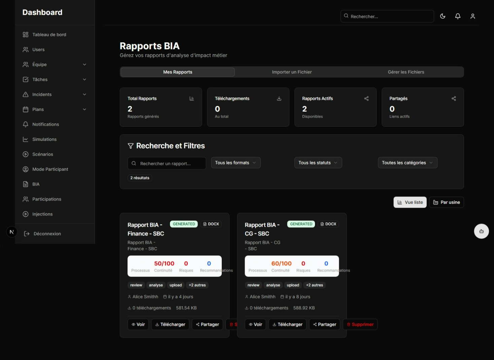

> 📸 **SCREENSHOT-05-BIA-LIST.jpeg** - Liste des rapports BIA

#### Étape 2 : Remplir le Formulaire

Complétez les informations suivantes :

**Informations Générales**

- **Nom du processus** : Ex. "Ligne de production principale"
- **Description** : Détaillez le processus
- **Usine/Site** : Sélectionnez ou créez une catégorie (ex. "Usine A")
- **Responsable** : Personne en charge du processus

**Impacts**

- **Impact Financier** : Faible, Moyen, Élevé, Critique
- **Impact Réputationnel** : Faible, Moyen, Élevé, Critique
- **Impact Opérationnel** : Faible, Moyen, Élevé, Critique
- **Impact Juridique** : Faible, Moyen, Élevé, Critique

**Objectifs de Reprise**

- **RTO (Recovery Time Objective)** : Délai maximum acceptable d'interruption (ex. 4 heures)
- **RPO (Recovery Point Objective)** : Perte de données maximum acceptable (ex. 1 heure)

**Dépendances**

- **Systèmes informatiques** : Liste des systèmes critiques
- **Équipements** : Machines, infrastructures nécessaires
- **Fournisseurs** : Prestataires externes essentiels
- **Personnel clé** : Personnes indispensables
- **Autres processus** : Processus interdépendants

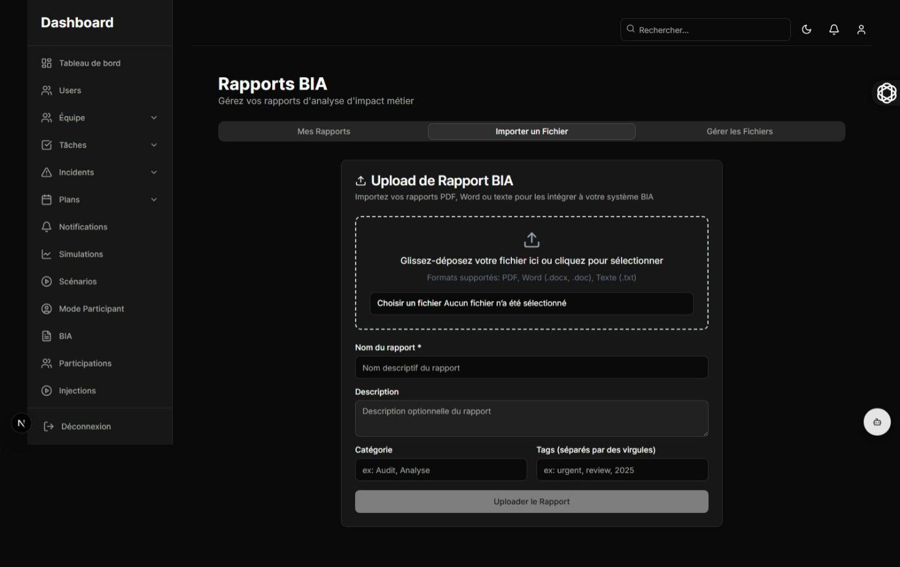

> 📸 **SCREENSHOT-06-BIA-FORM.jpeg** - Formulaire de création d'un rapport BIA (vue 1)

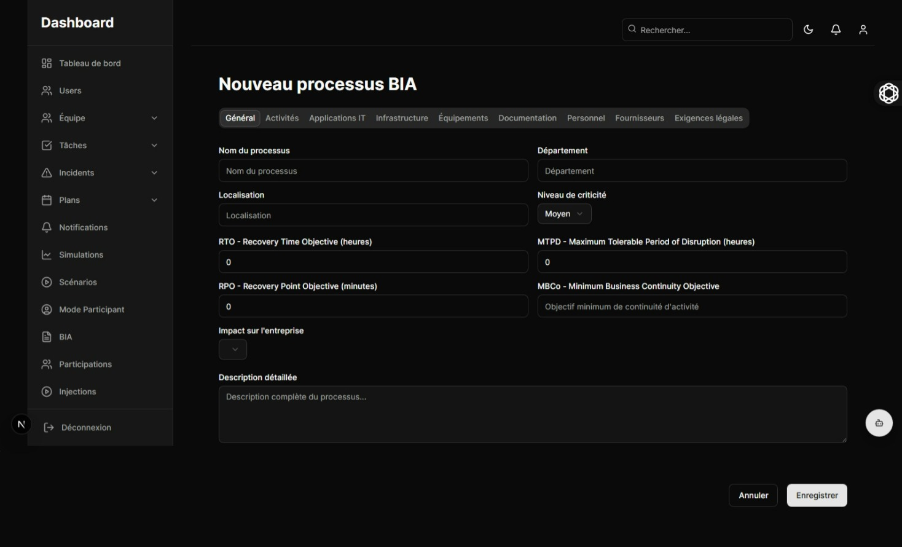

> 📸 **SCREENSHOT-06-BIA-FORM2.jpeg** - Formulaire de création d'un rapport BIA (vue 2)

#### Étape 3 : Sauvegarder

Cliquez sur **"Enregistrer"** pour créer le rapport. Vous pouvez le modifier à tout moment.

### 3.2 Analyser un Rapport BIA

Une fois le rapport créé, vous pouvez générer une analyse pour obtenir des recommandations.

#### Option 1 : Analyse par IA (Google Gemini)

1. Ouvrez le rapport que vous souhaitez analyser
2. Cliquez sur le bouton **"Analyser avec l'IA"**
3. Patientez quelques secondes (l'IA analyse vos données)
4. Les résultats s'affichent avec :
   - **Score de criticité** : Note de 1 à 10
   - **Points de défaillance uniques (SPOFs)** : Risques critiques identifiés
   - **Recommandations** : Actions prioritaires à mener
   - **Analyse détaillée** : Commentaires sur chaque aspect

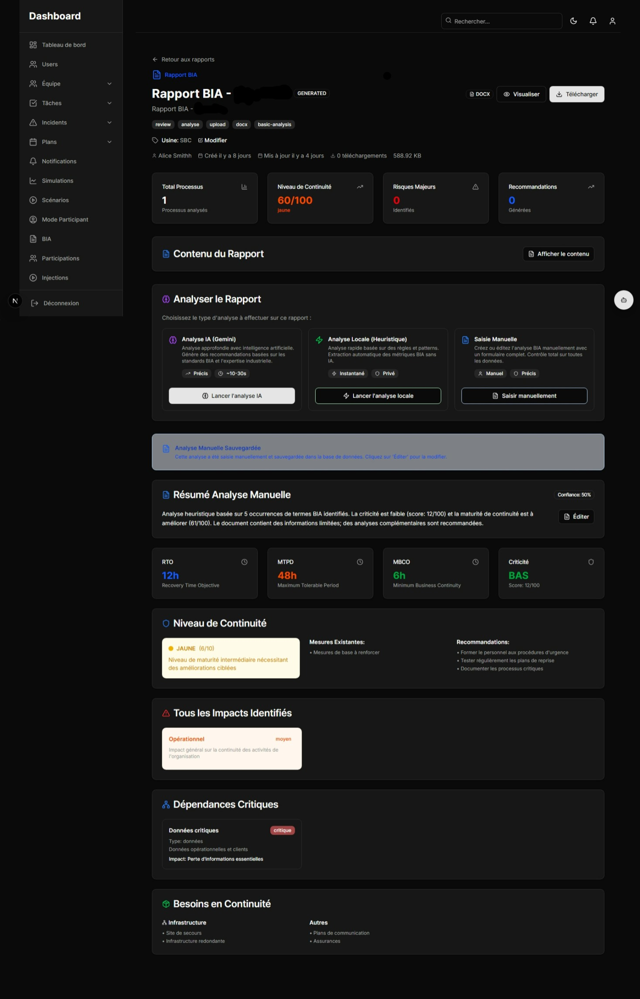

> 📸 **SCREENSHOT-07-BIA-AI-ANALYSIS.jpeg** - Résultats de l'analyse IA

#### Option 2 : Analyse Heuristique

1. Sur la même page, cliquez sur **"Analyse Heuristique"**
2. L'analyse est générée instantanément
3. Vous obtenez :
   - Un score de criticité calculé selon des règles prédéfinies
   - Des recommandations standards basées sur les bonnes pratiques
   - Une évaluation rapide de chaque dimension

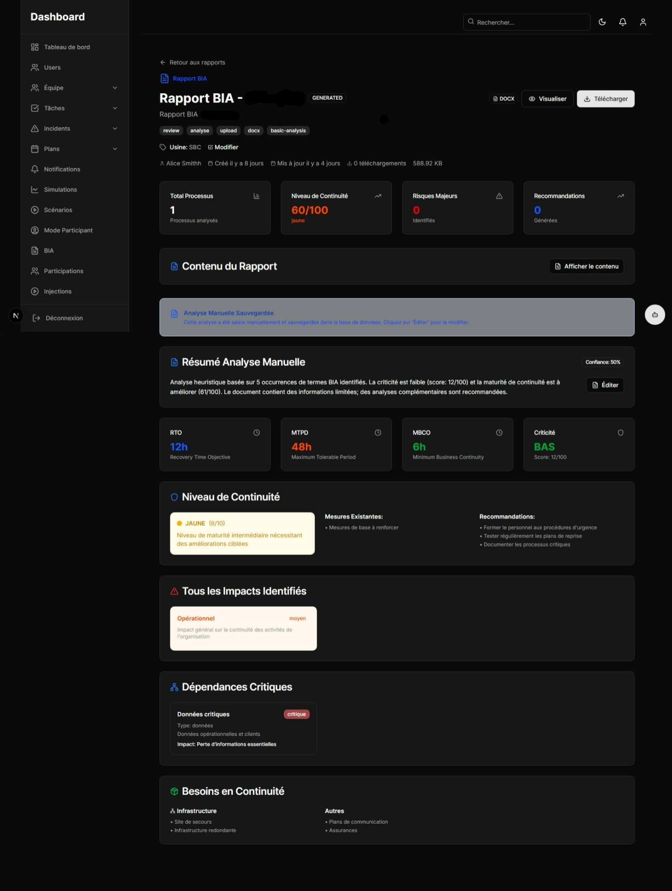

> 📸 **SCREENSHOT-08-BIA-LOCAL-ANALYSIS.jpeg** - Résultats de l'analyse heuristique

#### Comparaison des Deux Analyses

| Critère          | Analyse IA              | Analyse Heuristique |
| ---------------- | ----------------------- | ------------------- |
| Vitesse          | 5-10 secondes           | Instantané          |
| Personnalisation | Très élevée             | Modérée             |
| Recommandations  | Spécifiques au contexte | Standards           |
| Nécessite API    | Oui (Google Gemini)     | Non                 |

### 3.3 Analyse Consolidée par Usine

La fonctionnalité la plus puissante du module BIA : obtenir une vue d'ensemble de tous les processus d'un site.

#### Étape 1 : Vue par Usine

1. Sur la page de liste des rapports, cliquez sur l'onglet **"Par usine"**
2. Les rapports sont regroupés par catégorie (usine/site)
3. Vous voyez le nombre de rapports pour chaque usine

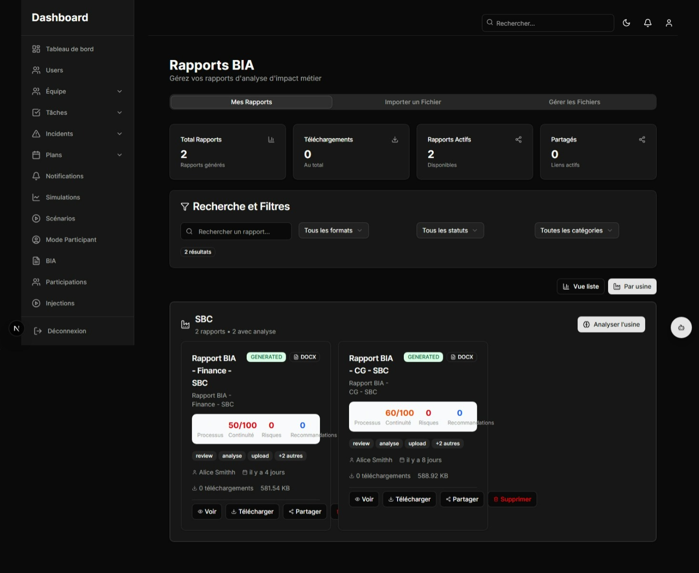

> 📸 **SCREENSHOT-09-BIA-BY-FACTORY.jpeg** - Rapports groupés par usine

#### Étape 2 : Lancer l'Analyse Globale

1. Pour une usine donnée, cliquez sur **"Analyser l'usine"**
2. Le système récupère tous les rapports de cette usine
3. Il agrège les données et génère une analyse consolidée

#### Étape 3 : Consulter les Résultats

La page d'analyse consolidée affiche :

**Métriques Globales**

- Nombre total de processus analysés
- Score de criticité moyen de l'usine
- Nombre de SPOFs identifiés au niveau du site
- Nombre de recommandations stratégiques

**Graphiques et Visualisations**

- Distribution des niveaux de criticité (Critique, Important, Modéré)
- Répartition des impacts (Financier, Réputationnel, Opérationnel)
- Timeline des RTO (processus classés par ordre de priorité de reprise)

**Top des Risques Systémiques**

- Risques qui affectent plusieurs processus
- Dépendances communes identifiées comme des points de défaillance

**Liste des Processus Critiques**

- Tableau trié par criticité décroissante
- Liens vers chaque rapport individuel

**Recommandations Consolidées**

- Actions priorisées pour améliorer la résilience globale du site
- Investissements recommandés (redondance, formation, etc.)

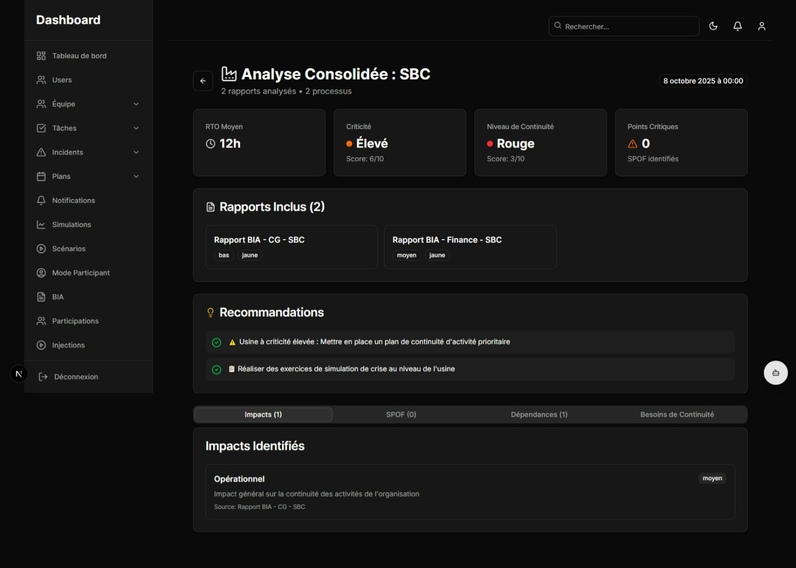

> 📸 **SCREENSHOT-10-FACTORY-ANALYSIS.jpeg** - Page d'analyse consolidée d'une usine

### 3.4 Exporter et Partager

#### Exporter un Rapport

Chaque rapport peut être exporté en :

- **PDF** : Pour impression ou archivage
- **Excel** : Pour analyse dans un tableur
- **Word** : Pour édition dans un document

Cliquez sur le bouton **"Exporter"** et choisissez le format souhaité.

#### Partager un Rapport

1. Sur la page du rapport, cliquez sur **"Partager"**
2. Un lien unique est généré
3. Copiez ce lien et envoyez-le à vos collaborateurs
4. Les personnes ayant le lien peuvent consulter le rapport (en lecture seule)

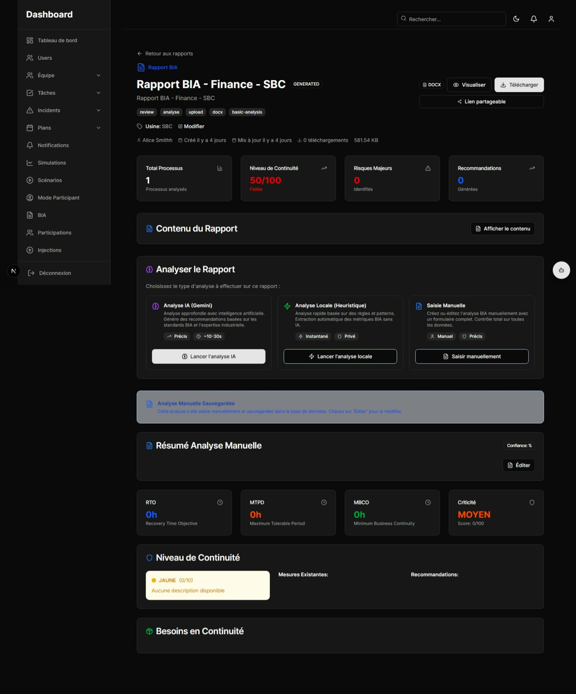

> 📸 **SCREENSHOT-11-BIA-EXPORT.jpeg** - Options d'export et de partage

---

## Module de Simulation de Crise

Le module de simulation permet de créer, gérer et animer des exercices de crise pour entraîner vos équipes.

### 4.1 Créer une Simulation (Administrateur)

#### Étape 1 : Informations de Base

1. Accédez au menu **"Admin"** → **"Simulations"**
2. Cliquez sur **"+ Nouvelle Simulation"**
3. Remplissez :
   - **Nom** : Ex. "Cyberattaque Ransomware - Usine A"
   - **Scénario** : Description de la situation de crise
   - **Objectifs** : Ce que vous souhaitez tester (ex. "Valider la procédure de sauvegarde")
   - **Date et heure prévues** : Quand l'exercice aura lieu

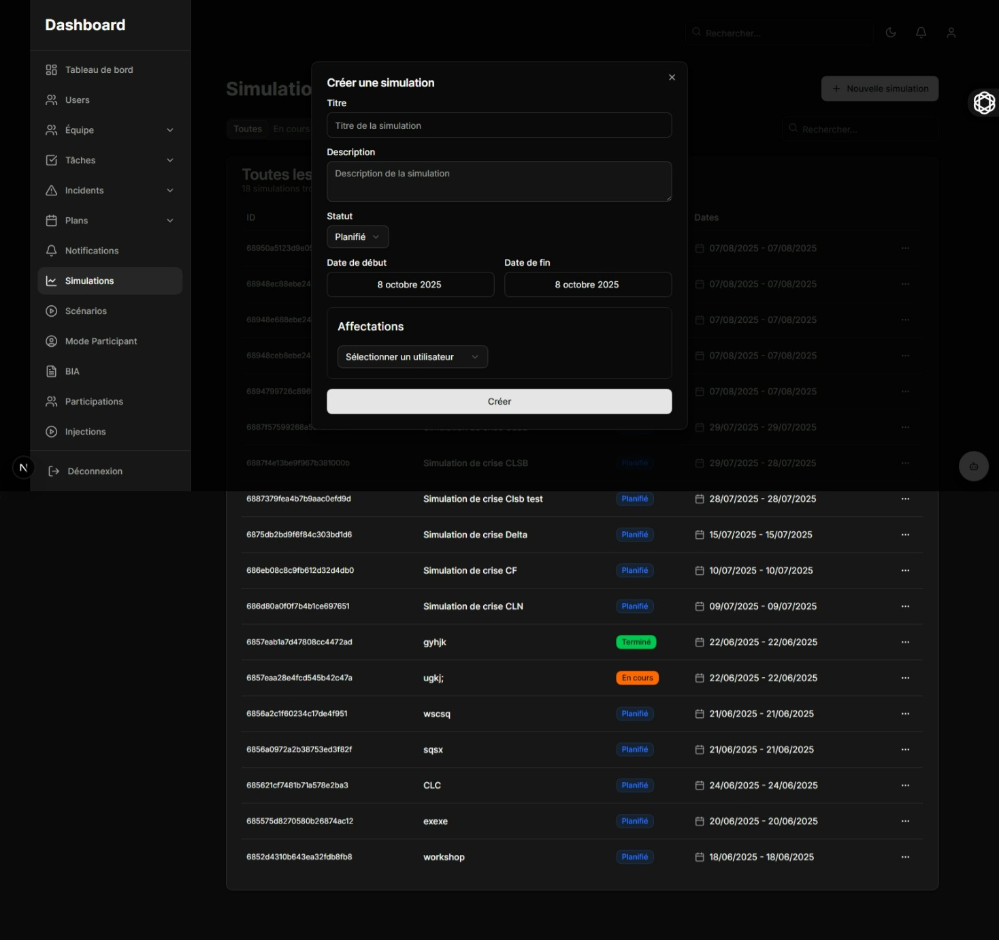

> 📸 **SCREENSHOT-12-SIM-CREATE.jpeg** - Formulaire de création de simulation

#### Étape 2 : Définir les Tâches

Les tâches sont les actions que les participants devront réaliser.

1. Dans la simulation créée, allez dans l'onglet **"Tâches"**
2. Cliquez sur **"+ Nouvelle Tâche"**
3. Pour chaque tâche, définissez :
   - **Titre** : Ex. "Isoler le réseau de l'usine"
   - **Description détaillée** : Instructions précises
   - **Assignation** : Utilisateur ou équipe responsable
   - **Priorité** : Faible, Moyenne, Élevée, Critique
   - **Échéance** : Temps alloué (ex. "Doit être fait dans les 30 minutes")

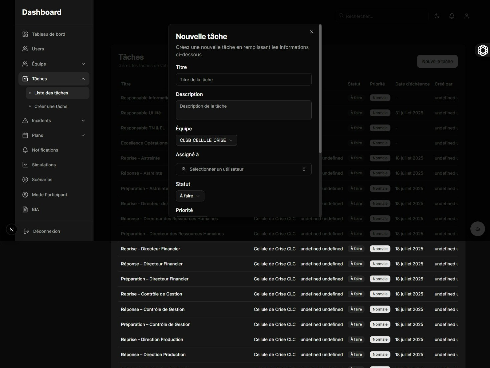

> 📸 **SCREENSHOT-13-TASK-CREATE.jpeg** - Formulaire de création de tâche

#### Étape 3 : Préparer les Injections

Les injections sont des événements que l'animateur déclenche pendant la simulation pour la dynamiser.

1. Allez dans l'onglet **"Injections"**
2. Cliquez sur **"+ Nouvelle Injection"**
3. Types d'injections disponibles :

   - **Email** : Simuler un email (ex. d'un client paniqué)
   - **Appel téléphonique** : Script d'un appel à jouer
   - **Notification** : Alerte système
   - **Mise à jour de situation** : Évolution du scénario

4. Pour chaque injection, spécifiez :
   - **Type et contenu**
   - **Moment de déclenchement** : Ex. "T+1h" (1 heure après le début)
   - **Destinataire** : Équipe ou personne concernée

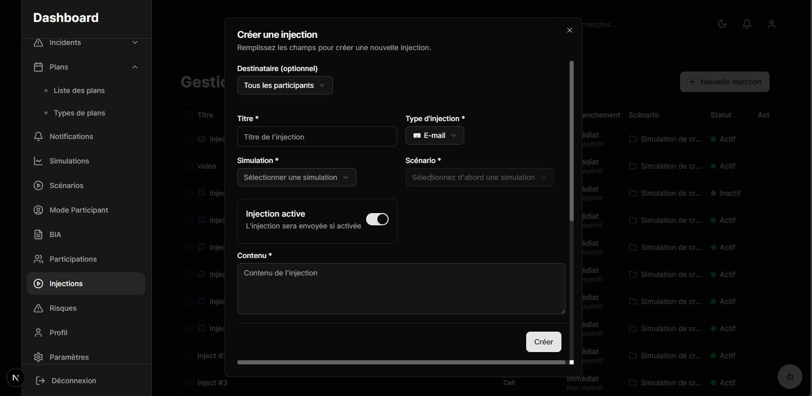

> 📸 **SCREENSHOT-14-INJECTION-CREATE.png** - Formulaire de création d'injection

#### Étape 4 : Assigner les Participants

1. Dans l'onglet **"Participants"**, cliquez sur **"Assigner des participants"**
2. Sélectionnez :
   - Des utilisateurs individuels
   - Des équipes entières
3. Définissez leur rôle dans la simulation
4. Validez

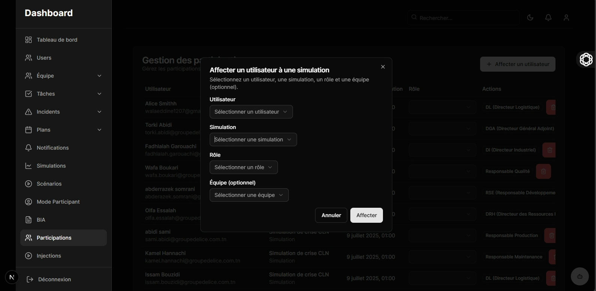

> 📸 **SCREENSHOT-15-SIM-ASSIGN.png** - Assignation des participants à une simulation

### 4.2 Animer une Simulation (Animateur)

#### Démarrer la Simulation

1. Lorsque vous êtes prêt, changez le statut de la simulation de **"BROUILLON"** à **"EN COURS"**
2. Tous les participants reçoivent une notification
3. Le chronomètre démarre automatiquement

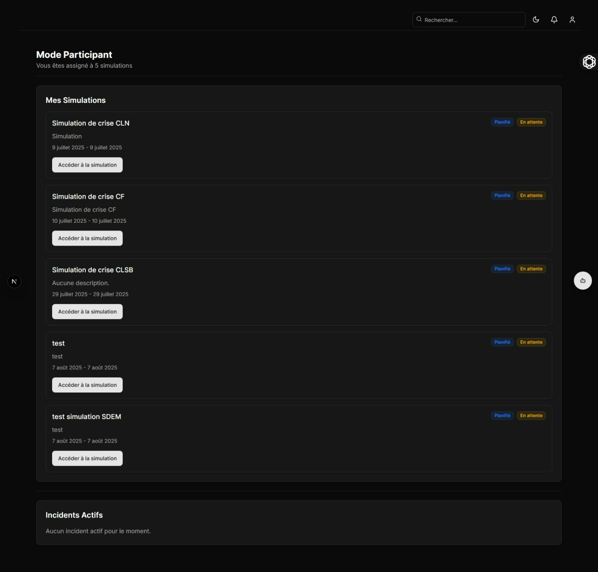

> 📸 **SCREENSHOT-16-SIM-START.jpeg** - Démarrage d'une simulation

#### Tableau de Bord Animateur

Pendant la simulation, vous avez accès à un tableau de bord complet :

**Vue d'Ensemble**

- Temps écoulé depuis le début
- Nombre de tâches complétées / total
- Nombre d'injections déclenchées / planifiées
- Nombre de participants actifs

**Suivi des Tâches en Temps Réel**

- Liste de toutes les tâches avec leur statut :
  - ✅ **Terminée** : Tâche complétée avec l'heure
  - 🔄 **En cours** : En cours de réalisation
  - ⏳ **À faire** : Pas encore démarrée
  - ⚠️ **En retard** : Échéance dépassée
- Commentaires des participants sur chaque tâche

**Contrôle des Injections**

- Liste des injections planifiées avec leur timing
- Bouton pour déclencher manuellement une injection
- Historique des injections déjà envoyées

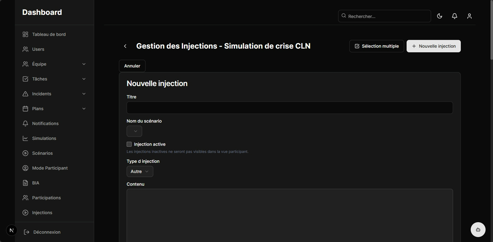

> 📸 **SCREENSHOT-17-ANIMATOR-DASHBOARD.png** - Tableau de bord de l'animateur

#### Déclencher une Injection

1. Dans la section "Injections planifiées", trouvez l'injection souhaitée
2. Vous pouvez :
   - Attendre l'heure prévue (déclenchement automatique)
   - Cliquer sur **"Déclencher maintenant"** pour l'envoyer immédiatement
3. Les participants concernés reçoivent l'injection (email, notification, etc.)

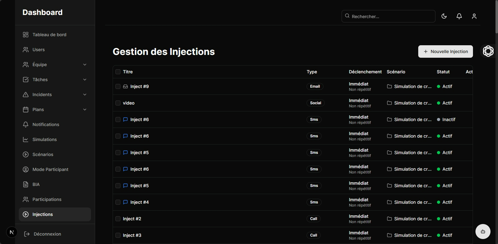

> 📸 **SCREENSHOT-18-TRIGGER-INJECTION.png** - Déclenchement d'une injection

### 4.3 Participer à une Simulation (Participant)

#### Recevoir une Notification

Lorsqu'une simulation démarre et que vous êtes assigné :

1. Vous recevez une notification (dans l'application et/ou par email)
2. Cliquez dessus pour accéder à votre espace de simulation

#### Vue Participant

Votre interface affiche :

**Contexte de la Simulation**

- Encadré rouge avec le scénario de crise
- Objectifs de l'exercice
- Durée prévue

**Vos Tâches Assignées**

- Liste des tâches qui vous concernent (ou concernent votre équipe)
- Pour chaque tâche :
  - Priorité et échéance
  - Description détaillée
  - Statut actuel

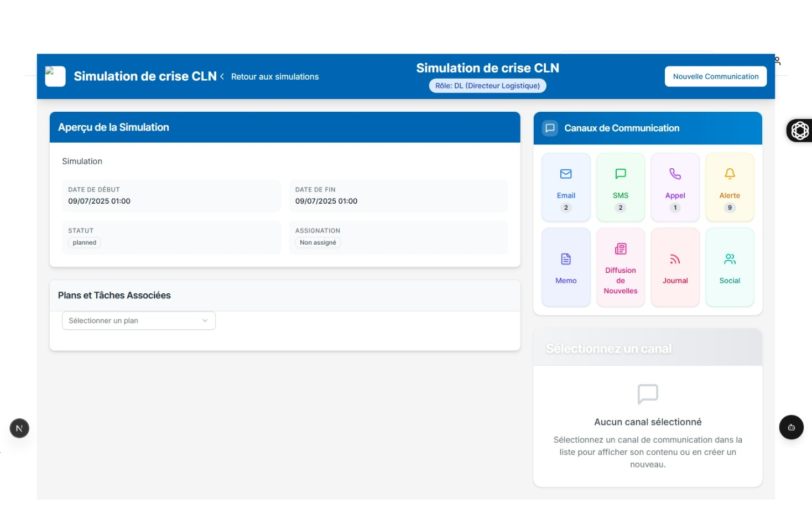

> 📸 **SCREENSHOT-19-PARTICIPANT-VIEW.jpeg** - Interface du participant

#### Gérer une Tâche

1. **Marquer comme en cours** : Cliquez pour signaler que vous commencez la tâche
2. **Ajouter un commentaire** : Notez votre progression, les difficultés rencontrées
3. **Marquer comme terminée** : Une fois l'action réalisée, cliquez pour finaliser

**Exemple de flux de travail :**

```
Tâche reçue → En cours → Commentaire ajouté → Terminée
```

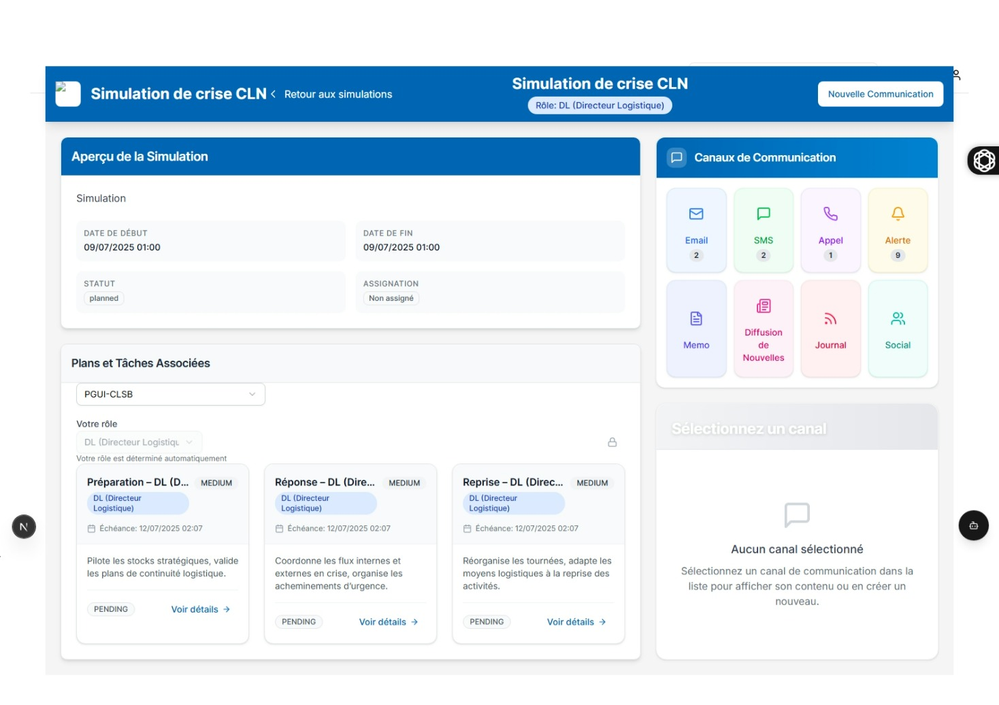

> 📸 **SCREENSHOT-20-TASK-MANAGEMENT.jpeg** - Gestion d'une tâche par le participant

#### Recevoir des Injections

Pendant la simulation, vous pouvez recevoir des injections :

- Elles apparaissent sous forme de notifications
- Lisez le contenu et réagissez en conséquence
- Si une nouvelle tâche découle de l'injection, elle apparaîtra dans votre liste

### 4.4 Clôturer et Débriefer

#### Terminer la Simulation

1. Lorsque toutes les tâches sont complétées ou que le temps est écoulé
2. L'animateur change le statut à **"TERMINÉE"**
3. Tous les participants en sont informés

#### Rapport de Simulation

La plateforme génère automatiquement un rapport contenant :

- **Résumé** : Durée réelle, nombre de tâches complétées, taux de réussite
- **Chronologie** : Timeline de toutes les actions et injections
- **Performance par équipe** : Temps de réalisation moyen, tâches en retard
- **Commentaires des participants** : Feedbacks collectés
- **Recommandations** : Points d'amélioration identifiés

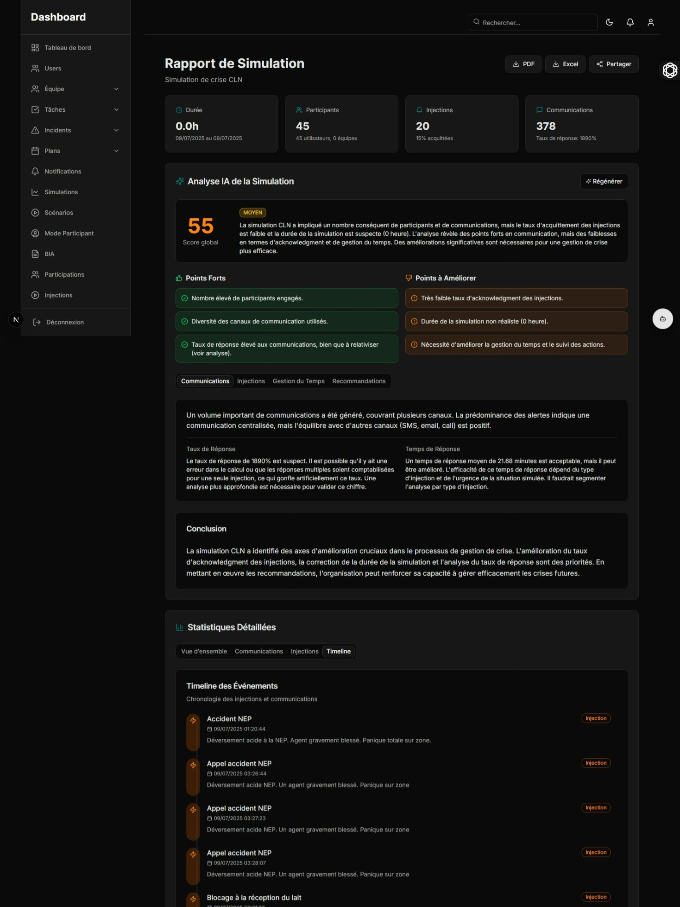

> 📸 **SCREENSHOT-21-SIM-REPORT.jpeg** - Rapport final d'une simulation

#### Session de Débriefing

Utilisez le rapport pour animer une réunion de débriefing :

- Qu'est-ce qui a bien fonctionné ?
- Quels ont été les points de blocage ?
- Quelles procédures doivent être améliorées ?
- Quelles formations supplémentaires sont nécessaires ?

---

## Gestion des Utilisateurs et Équipes

### 5.1 Gestion des Utilisateurs (Admin)

#### Voir la Liste des Utilisateurs

1. Menu **"Admin"** → **"Utilisateurs"**
2. Vous voyez tous les comptes inscrits avec :
   - Nom et email
   - Rôle (ADMIN ou USER)
   - Date d'inscription
   - Statut (Actif / Inactif)

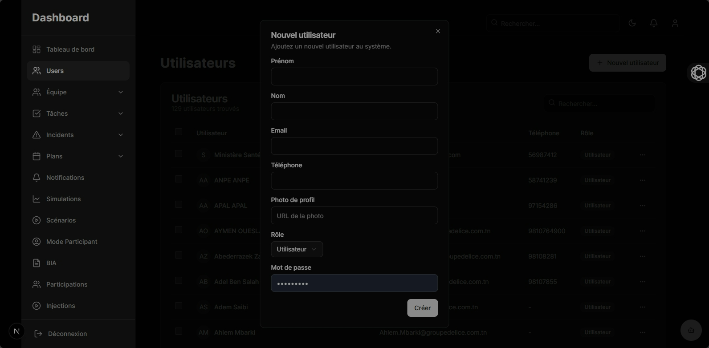

> 📸 **SCREENSHOT-22-USER-LIST.png** - Liste de tous les utilisateurs

#### Modifier un Utilisateur

1. Cliquez sur un utilisateur dans la liste
2. Vous pouvez modifier :
   - **Informations personnelles** : Nom, email
   - **Rôle** : Passer de USER à ADMIN (ou inversement)
   - **Statut** : Activer ou désactiver le compte
3. Cliquez sur **"Enregistrer"**

**⚠️ Attention** : Changer un utilisateur en ADMIN lui donne accès à toutes les fonctionnalités de gestion.

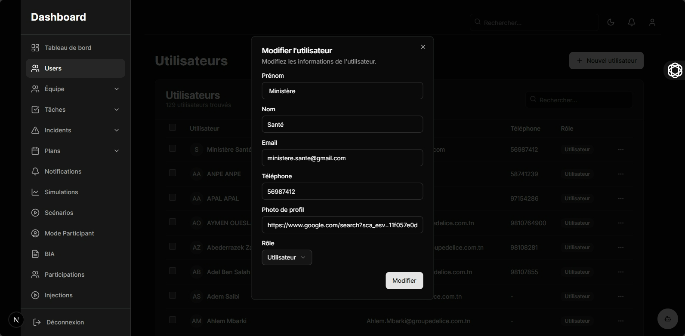

> 📸 **SCREENSHOT-23-USER-EDIT.png** - Formulaire d'édition d'un utilisateur

#### Différences entre les Rôles

| Fonctionnalité                    | USER | ADMIN |
| --------------------------------- | ---- | ----- |
| Créer des rapports BIA personnels | ✅   | ✅    |
| Voir tous les rapports BIA        | ❌   | ✅    |
| Participer aux simulations        | ✅   | ✅    |
| Créer et gérer des simulations    | ❌   | ✅    |
| Gérer les utilisateurs            | ❌   | ✅    |
| Créer des équipes                 | ❌   | ✅    |
| Accès au panneau d'administration | ❌   | ✅    |

### 5.2 Gestion des Équipes (Admin)

#### Créer une Équipe

1. Menu **"Admin"** → **"Équipes"**
2. Cliquez sur **"+ Nouvelle Équipe"**
3. Remplissez :
   - **Nom de l'équipe** : Ex. "Équipe de Crise IT", "Cellule de Communication"
   - **Description** : Rôle et responsabilités de l'équipe
4. Cliquez sur **"Créer"**

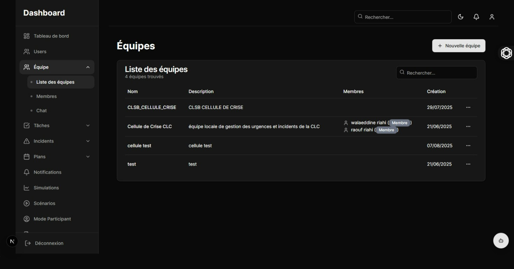

> 📸 **SCREENSHOT-24-TEAM-CREATE.jpeg** - Formulaire de création d'équipe

#### Ajouter des Membres

1. Ouvrez l'équipe créée
2. Cliquez sur **"+ Ajouter un membre"**
3. Sélectionnez des utilisateurs dans la liste déroulante
4. Validez

**💡 Astuce** : Un utilisateur peut faire partie de plusieurs équipes.

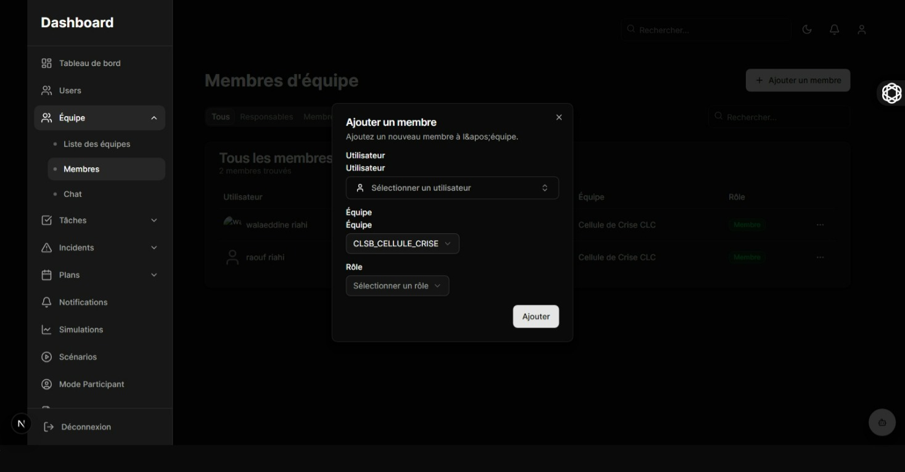

> 📸 **SCREENSHOT-25-TEAM-MEMBERS.png.jpeg** - Ajout de membres à une équipe
> ⚠️ **Note**: Ce fichier a une double extension et devrait être renommé

#### Utiliser les Équipes

Les équipes simplifient l'assignation lors des simulations :

- Au lieu d'assigner une tâche à un utilisateur individuel
- Vous assignez la tâche à une équipe entière
- Tous les membres de l'équipe verront la tâche et pourront collaborer

**Exemple d'organisation :**

```
Équipe de Crise IT
├── Jean Dupont (Admin systèmes)
├── Marie Martin (Responsable cybersécurité)
└── Pierre Durand (Ingénieur réseau)

Cellule de Communication
├── Sophie Bernard (Directrice communication)
├── Luc Petit (Chargé de relations presse)
└── Emma Roux (Community manager)
```

---

## Tableau de Bord

### 6.1 Vue d'Ensemble

Le tableau de bord principal est votre page d'accueil après connexion. Il offre une vue consolidée de votre activité.

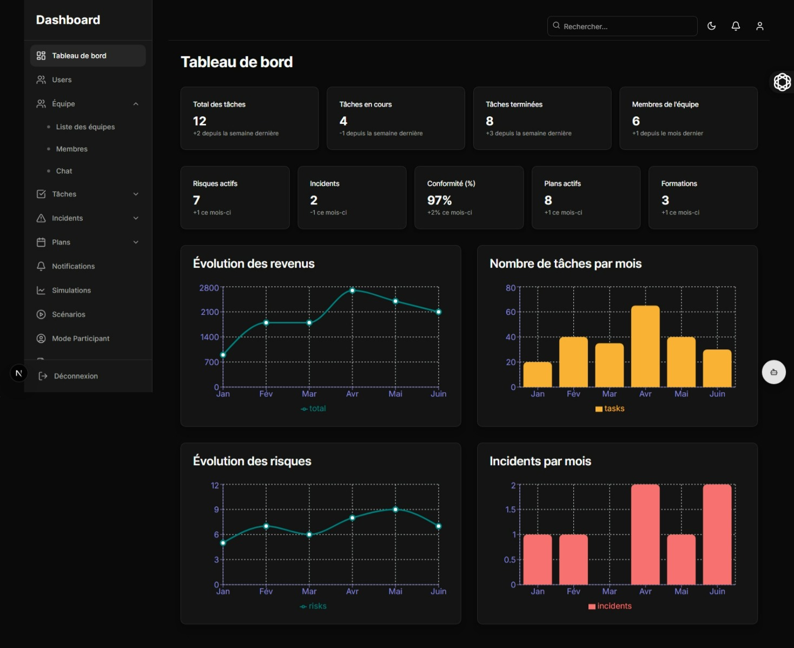

> 📸 **SCREENSHOT-26-FULL-DASHBOARD.jpeg** - Tableau de bord principal

### 6.2 Widgets Disponibles

#### Mes Rapports BIA

- Nombre de rapports créés
- Rapports récents
- Accès rapide à la création

#### Simulations

- Simulations en cours
- Prochaines simulations planifiées
- Historique des simulations passées

#### Mes Tâches

- Tâches assignées dans les simulations actives
- Tâches en retard (si applicable)
- Tâches complétées récemment

#### Statistiques (Admin uniquement)

- Nombre total d'utilisateurs
- Nombre d'équipes
- Taux de participation aux simulations
- Scores de criticité moyens des sites

### 6.3 Notifications

Le centre de notifications (icône cloche) affiche :

- Nouvelles simulations auxquelles vous êtes assigné
- Tâches qui vous sont confiées
- Injections reçues pendant une simulation
- Commentaires sur vos rapports BIA

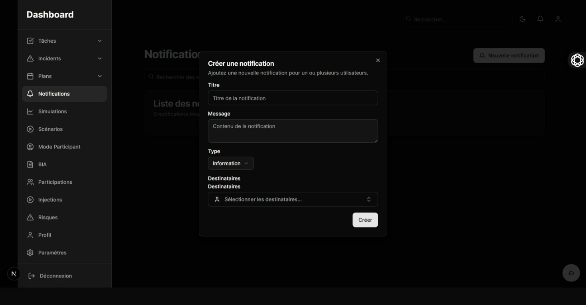

> 📸 **SCREENSHOT-27-NOTIFICATIONS.jpeg** - Centre de notifications

---

## FAQ et Dépannage

### Questions Fréquentes

#### Général

**Q : Je n'ai pas reçu l'email de confirmation d'inscription**

- Vérifiez votre dossier spam/courrier indésirable
- Vérifiez que l'adresse email saisie est correcte
- Contactez votre administrateur système

**Q : J'ai oublié mon mot de passe**

- Sur la page de connexion, cliquez sur "Mot de passe oublié"
- Suivez les instructions reçues par email
- Si vous utilisez Google pour vous connecter, réinitialisez via votre compte Google

**Q : Comment changer mon mot de passe ?**

- Allez dans votre profil (icône utilisateur en haut à droite)
- Cliquez sur "Paramètres"
- Section "Sécurité" → "Modifier le mot de passe"

#### Module BIA

**Q : Combien de temps prend l'analyse IA ?**

- Entre 5 et 15 secondes selon la complexité du rapport
- Si cela prend plus longtemps, vérifiez votre connexion internet
- En cas d'erreur, essayez l'analyse heuristique

**Q : Quelle différence entre analyse IA et heuristique ?**

- **Analyse IA** : Personnalisée, contextuelle, recommandations spécifiques
- **Heuristique** : Rapide, basée sur des règles standards, toujours disponible

**Q : Puis-je modifier un rapport après l'avoir analysé ?**

- Oui, vous pouvez toujours modifier un rapport
- Après modification, relancez l'analyse pour obtenir de nouveaux résultats

**Q : Comment partager un rapport avec quelqu'un qui n'a pas de compte ?**

- Utilisez la fonction "Partager" pour générer un lien unique
- Ce lien permet la consultation en lecture seule
- Le lien reste valide jusqu'à ce que vous le révoquiez

#### Module Simulation

**Q : Puis-je modifier une simulation en cours ?**

- L'animateur peut ajouter des tâches ou injections même pendant la simulation
- Les modifications de scénario sont déconseillées une fois l'exercice démarré

**Q : Un participant peut-il se désister d'une simulation ?**

- Contactez l'animateur ou un administrateur
- Seuls les admins peuvent retirer un participant

**Q : Les participants voient-ils les tâches des autres ?**

- Non, chaque participant ne voit que ses propres tâches
- L'animateur voit toutes les tâches de tous les participants

**Q : Puis-je réutiliser une simulation ?**

- Oui, vous pouvez dupliquer une simulation existante
- Modifiez les dates et les participants selon vos besoins

#### Équipes

**Q : Puis-je faire partie de plusieurs équipes ?**

- Oui, un utilisateur peut appartenir à autant d'équipes que nécessaire

**Q : Comment supprimer une équipe ?**

- Menu Admin → Équipes → Sélectionner l'équipe → Supprimer
- Attention : les utilisateurs ne sont pas supprimés, seule l'équipe l'est

### Problèmes Techniques

#### La page ne charge pas / Erreur 500

**Solutions :**

1. Rafraîchissez la page (F5 ou Ctrl+R)
2. Videz le cache de votre navigateur
3. Essayez un autre navigateur (Chrome, Firefox, Edge)
4. Vérifiez votre connexion internet
5. Contactez le support technique

#### Les graphiques ne s'affichent pas

**Solutions :**

1. Assurez-vous que JavaScript est activé dans votre navigateur
2. Désactivez temporairement les bloqueurs de publicités
3. Mettez à jour votre navigateur vers la dernière version

#### Je ne reçois pas les notifications

**Solutions :**

1. Vérifiez vos paramètres de notification dans votre profil
2. Autorisez les notifications du site dans votre navigateur
3. Vérifiez que votre email est correctement configuré

#### L'export PDF ne fonctionne pas

**Solutions :**

1. Autorisez les pop-ups pour le site S.U.R.V.I.V.E. Resilience
2. Vérifiez que vous avez un lecteur PDF installé
3. Essayez un autre format (Excel, Word)

---

## Glossaire

**BIA (Business Impact Analysis)** : Analyse d'Impact sur les Activités. Processus d'évaluation des conséquences d'une interruption des activités métier.

**RTO (Recovery Time Objective)** : Objectif de Temps de Reprise. Délai maximal dans lequel un processus métier doit être rétabli après un sinistre.

**RPO (Recovery Point Objective)** : Objectif de Point de Reprise. Quantité maximale de données qu'une organisation peut se permettre de perdre lors d'un incident.

**SPOF (Single Point of Failure)** : Point de Défaillance Unique. Élément d'un système dont la défaillance entraînerait l'arrêt complet du système.

**Simulation de Crise** : Exercice pratique visant à entraîner les équipes à réagir face à une situation d'urgence.

**Injection** : Événement introduit par l'animateur pendant une simulation pour dynamiser l'exercice et tester les réactions.

**Animateur** : Personne responsable de la préparation et du déroulement d'une simulation de crise.

**Participant** : Utilisateur assigné à une simulation et devant réaliser les tâches qui lui sont confiées.

**Équipe** : Groupe d'utilisateurs organisé selon des responsabilités communes (ex: Équipe IT, Cellule de crise).

**Criticité** : Niveau d'importance d'un processus, évalué selon plusieurs dimensions (impact financier, opérationnel, réputationnel, etc.).

**Analyse Heuristique** : Méthode d'analyse basée sur des règles et algorithmes prédéfinis, sans recours à l'intelligence artificielle.

**Analyse IA** : Méthode d'analyse utilisant l'intelligence artificielle (Google Gemini) pour fournir des recommandations personnalisées.

---

## Support et Contact

Pour toute question, problème technique ou demande de fonctionnalité :

📧 **Email** : support@survive-resilience.com  
📞 **Téléphone** : +33 (0)1 XX XX XX XX  
💬 **Chat en ligne** : Disponible du lundi au vendredi, 9h-18h

**Documentation en ligne** : https://docs.survive-resilience.com  
**Vidéos tutoriels** : https://www.youtube.com/@survive-resilience

---

_Guide utilisateur S.U.R.V.I.V.E. Resilience - Version 1.0 - Dernière mise à jour : Mars 2025_
